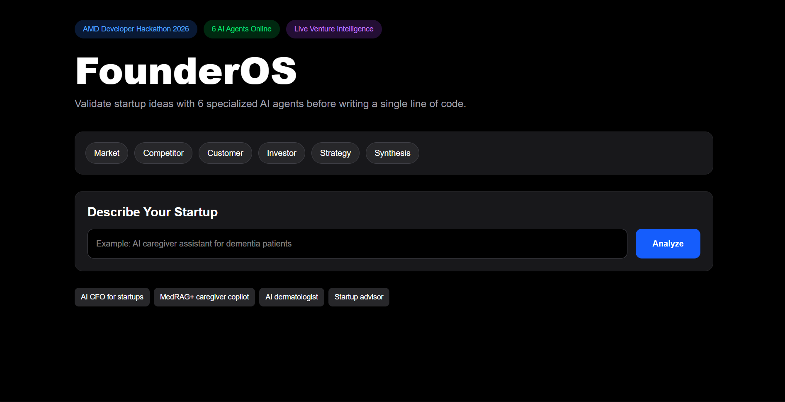

# FounderOS

FounderOS is a multi-agent venture intelligence platform that helps founders validate startup ideas before building.

## Features

- Market Analysis Agent
- Competitor Analysis Agent
- Customer Analysis Agent
- Investor Analysis Agent
- Strategy Agent
- Executive Synthesis Agent

## Architecture

User Input
↓
Market Agent
Competitor Agent
Customer Agent
Investor Agent
Strategy Agent
↓
Synthesis Agent
↓
FounderOS Report

## Tech Stack

Frontend:
- Next.js
- React
- Tailwind

Backend:
- FastAPI
- Fireworks AI
- Python

## AMD Hackathon Track

Track 3: Unicorn Pre-Screening

## Fireworks Usage

FounderOS uses Fireworks-hosted LLMs to simulate a venture capital diligence process.

## Deployment

Frontend: Vercel
Backend: Render

## Landing Page

